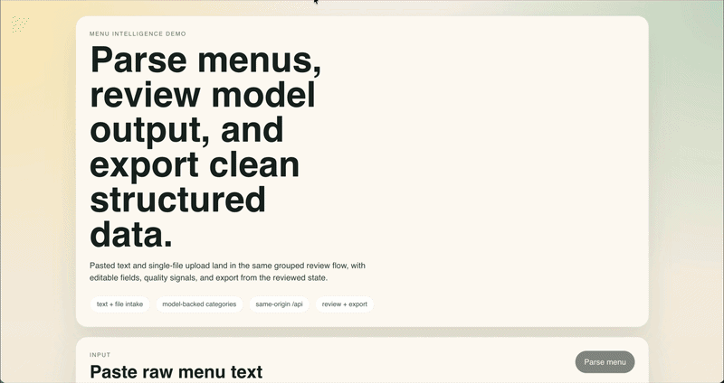
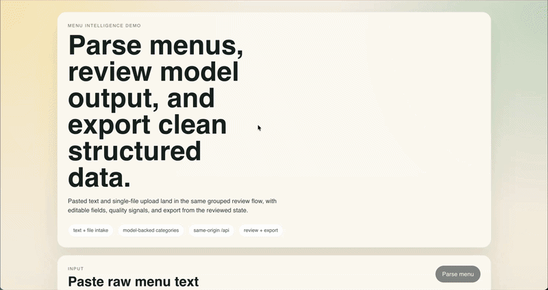

# Menu Intelligence

Menu Intelligence is an NLP course project and working web application that
turns raw menu content into structured menu data.



Demo: paste raw menu text, parse grouped results, and export the reviewed
result as JSON from the current UI.



Demo: upload a PDF menu, run document parsing, and inspect the grouped result
in the same review flow.

The system accepts:

- pasted menu text
- PDF menus
- menu images

It returns normalized menu items with:

- category labels
- extracted item names
- extracted prices
- extracted sizes

The project is built as both a product and a measurable NLP pipeline.

## Why This Project Exists

Restaurant menus are often published as free-form text, PDFs, or images meant
for people to read, not for software to process. That creates friction for:

- menu digitization
- catalog maintenance
- search and filtering
- delivery or POS integrations
- downstream analytics

The goal of this project is to make menu content machine-readable without
requiring manual re-entry.

## What The System Does

At a high level, the pipeline is:

1. ingest raw text, PDF, or image
2. extract document text
3. split text into candidate menu lines
4. detect headers, menu items, and noise
5. classify menu items into one of 12 categories
6. extract structured fields such as name, price, and size
7. return a structured JSON response for review in the UI

The current category label set is:

- `salads`
- `soups`
- `mains`
- `pizza`
- `pasta`
- `burgers`
- `sides`
- `desserts`
- `breakfast`
- `drinks_hot`
- `drinks_cold`
- `other`

## Example

Input:

```text
Caesar with chicken 250 g - 390 RUB
Tomato basil soup 300 ml - 295 RUB
Double cheeseburger 290 g - 540 RUB
```

Output:

```json
{
  "items": [
    {
      "kind": "menu_item",
      "category": "salads",
      "fields": {
        "name": "Caesar with chicken",
        "prices": [
          {
            "value": 390,
            "currency": "RUB"
          }
        ],
        "sizes": [
          {
            "value": 250,
            "unit": "g"
          }
        ]
      }
    }
  ]
}
```

## NLP Framing

The project is evaluated as three related tasks:

- Task A: menu item categorization
- Task B: menu item information extraction
- Task C: end-to-end menu structuring from raw input

This matters because the system is not just a frontend demo. It includes:

- annotated datasets
- baseline experiments
- reproducible evaluation artifacts
- a deployed backend that uses the best measured category model

## Main Results

The final fixed dataset is `items.v2.jsonl` with 432 annotated menu items from
12 public menu sources and source-level train/validation/test splits.

Key results:

- best category model: enriched sparse Logistic Regression
- test accuracy: `0.8750`
- test Macro-F1: `0.8708`
- Task B BIO2 extraction baselines: `1.0000` token/entity micro-F1 on the released split

The current runtime category model combines:

- raw-text TF-IDF
- cleaned item-name TF-IDF
- structured slot-derived features

Field extraction remains deterministic.

For detailed results, see:

- [Experiments](docs/course/experiments.md)
- [Results log](docs/course/results-log.md)
- [Report source](report/main.tex)

## Stack

- Frontend: Vue 3 + Vite + TypeScript
- Backend: FastAPI
- Category runtime: scikit-learn sparse model
- OCR/document extraction: PDF text extraction + Tesseract/RapidOCR image OCR

## Repository Layout

```text
frontend/   Vue application
backend/    FastAPI application
.github/    CI workflows
docs/       report and research notes
data/       annotated datasets and evaluation fixtures
models/     trained model artifacts
ops/        deployment scripts
```

## Quick Start

### Frontend

```bash
cd frontend
npm install
npm run dev
```

### Backend

```bash
cd backend
python3 -m venv .venv
source .venv/bin/activate
pip install -e ".[dev]"
uvicorn app.main:app --reload
```

## Local Checks

```bash
make ci-local
```

This runs frontend tests, typechecking, and production build, plus backend
lint, backend tests, and runtime verification.

## API

- `GET /api/health`
- `GET /api/v1/health`
- `GET /api/version`
- `GET /api/v1/version`
- `GET /api/status`
- `POST /api/v1/menu/parse`
- `POST /api/v1/menu/parse-file`

## Research Materials

- [Problem statement](docs/course/problem-statement.md)
- [Annotation guide](docs/course/annotation-guide.md)
- [Dataset](docs/course/dataset.md)
- [Related work](docs/course/related-work.md)
- [Experiments](docs/course/experiments.md)
- [Results log](docs/course/results-log.md)
- [Live smoke log](docs/course/live-smoke-log.md)

## Deployment

- CI: `.github/workflows/ci.yml`
- Deploy workflow: `.github/workflows/deploy.yml`
- Remote sync: `ops/remote_sync.sh`
- Remote deploy: `ops/remote_deploy.sh`
